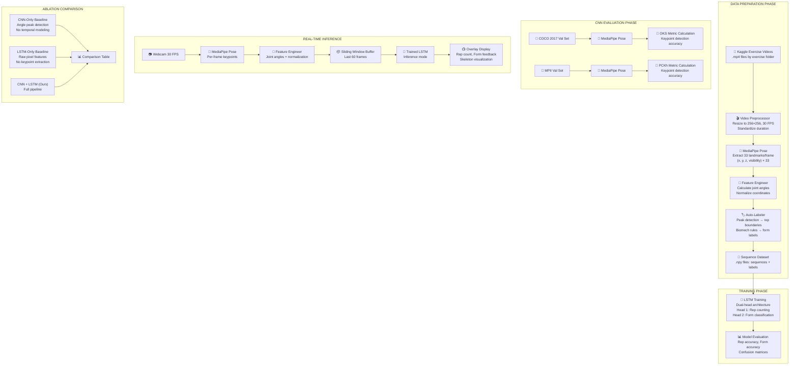

# Reps AI: Architecture & 2.5-Day Battle Plan
## Shaheer (CNN/Spatial) + Abdul Rehman (LSTM/Temporal)
### Deadline: May 11th — Presentation & Viva

---

## 1. SYSTEM ARCHITECTURE



---

## 2. DATA FLOW — STEP BY STEP

### Step 1: Video Preprocessing (Shaheer)
```
Input:  Kaggle dataset → /squat/*.mp4, /pushup/*.mp4, /bicep_curl/*.mp4
Output: Standardized video frames

Pipeline:
  1. Load video with OpenCV (cv2.VideoCapture)
  2. Standardize to 30 FPS (skip/duplicate frames as needed)
  3. Resize all frames to 256 × 256 pixels
  4. Normalize pixel values to [0, 1]
```

**File:** `cnn_module/video_preprocessor.py`

---

### Step 2: Keypoint Extraction with MediaPipe (Shaheer)
```
Input:  Standardized video frames
Output: Keypoint sequences → shape (num_frames, 33, 4)
        Each landmark = (x, y, z, visibility)

Pipeline:
  1. Initialize MediaPipe Pose (static_image_mode=False, model_complexity=2)
  2. Process each frame → get 33 pose landmarks
  3. Convert normalized coordinates to pixel coordinates
  4. Map MediaPipe 33 landmarks → COCO 17 keypoints (for COCO/MPII eval)
  5. Save full 33-landmark sequences for LSTM training
```

**File:** `cnn_module/keypoint_extractor.py`

> [!IMPORTANT]
> MediaPipe outputs 33 landmarks. COCO uses 17 keypoints. You need a mapping function:
> ```python
> # MediaPipe index → COCO keypoint name
> MEDIAPIPE_TO_COCO = {
>     0: 'nose',
>     2: 'left_eye', 5: 'right_eye',
>     7: 'left_ear', 8: 'right_ear',
>     11: 'left_shoulder', 12: 'right_shoulder',
>     13: 'left_elbow', 14: 'right_elbow',
>     15: 'left_wrist', 16: 'right_wrist',
>     23: 'left_hip', 24: 'right_hip',
>     25: 'left_knee', 26: 'right_knee',
>     27: 'left_ankle', 28: 'right_ankle',
> }
> ```

---

### Step 3: Feature Engineering (Shaheer)
```
Input:  Raw keypoint sequences (num_frames, 33, 4)
Output: Feature vectors per frame (num_frames, num_features)

Features to compute per frame:
  1. Joint angles (8 angles):
     - Left/Right knee angle (hip-knee-ankle)
     - Left/Right hip angle (shoulder-hip-knee)
     - Left/Right elbow angle (shoulder-elbow-wrist)
     - Left/Right shoulder angle (hip-shoulder-elbow)

  2. Normalized coordinates (relative to hip center):
     - All 33 landmarks → (x, y) relative to midpoint of hips
     - Scaled by torso length (shoulder-to-hip distance)

  3. Velocity features:
     - Frame-to-frame displacement of key joints
     - Angular velocity of primary joints

Total features per frame: ~8 angles + 66 normalized coords + 16 velocities ≈ 90 features
```

**File:** `cnn_module/feature_engineer.py`

---

### Step 4: Auto-Labeling (Abdul Rehman)
```
Input:  Feature sequences (num_frames, 90)
Output: Labels per sequence:
        - rep_count: int
        - rep_boundaries: [(start_frame, end_frame), ...]
        - form_labels: ['good', 'bad', 'good', ...] per rep

Pipeline:
  1. JOINT ANGLE SIGNAL:
     - For squats: track knee angle over time
     - For push-ups: track elbow angle over time
     - For bicep curls: track elbow angle over time

  2. REP DETECTION (peak detection):
     - Smooth angle signal (moving average, window=5)
     - Find local minima (bottom of rep) using scipy.signal.find_peaks
     - Each valley-to-valley = one rep
     - Record (start_frame, peak_frame, end_frame) for each rep

  3. FORM LABELING (biomechanical rules):
     SQUAT:
       ✅ Good: knee_angle ≤ 90° AND back_angle ≤ 30° AND no_knee_valgus
       ❌ Bad:  knee_angle > 120° (half rep) OR back_angle > 45° OR knee_valgus

     PUSH-UP:
       ✅ Good: elbow_angle ≤ 90° AND hip_sag_angle ≤ 10° AND full_extension
       ❌ Bad:  elbow_angle > 120° (half rep) OR hip_sag > 20° (sagging)

     BICEP CURL:
       ✅ Good: elbow_angle ≤ 40° (full contraction) AND shoulder_stable
       ❌ Bad:  elbow_angle > 80° (partial curl) OR shoulder_swing > 15°
```

**File:** `lstm_module/auto_labeler.py`

> [!TIP]
> For the viva, this is your answer to requirement #5: *"We defined biomechanical correctness using joint angle thresholds. Squat correctness requires knee flexion ≤90°, trunk inclination ≤30°, and absence of knee valgus, based on NSCA exercise guidelines."*

---

### Step 5: Sequence Dataset Creation (Abdul Rehman)
```
Input:  Feature sequences + labels
Output: PyTorch Dataset ready for training

Structure:
  - X: sliding windows of 60 frames (2 seconds at 30fps)
       shape = (num_samples, 60, 90)
  - Y_rep: rep count in window (0, 1, or 2 reps)
       shape = (num_samples, 1)
  - Y_form: form quality (0 = bad, 1 = good)
       shape = (num_samples, 1)

Sliding window:
  - Window size: 60 frames
  - Stride: 15 frames (overlap for more training samples)
  - Each window labeled with # of complete reps and avg form quality
```

**File:** `lstm_module/dataset.py`

---

### Step 6: LSTM Architecture & Training (Abdul Rehman)
```
Input:  Sequence dataset
Output: Trained LSTM model (.pth file)

Architecture:
  ┌─────────────────────────────────┐
  │  Input: (batch, 60, 90)         │
  │  60 timesteps, 90 features      │
  └────────────┬────────────────────┘
               ↓
  ┌─────────────────────────────────┐
  │  LSTM Layer 1                   │
  │  hidden_size=128, dropout=0.3   │
  └────────────┬────────────────────┘
               ↓
  ┌─────────────────────────────────┐
  │  LSTM Layer 2                   │
  │  hidden_size=64, dropout=0.3    │
  └────────────┬────────────────────┘
               ↓
        ┌──────┴──────┐
        ↓             ↓
  ┌───────────┐ ┌───────────────┐
  │ Rep Head  │ │ Form Head     │
  │ FC(64→32) │ │ FC(64→32)     │
  │ ReLU      │ │ ReLU          │
  │ FC(32→1)  │ │ FC(32→1)      │
  │ (regression)│ │ Sigmoid       │
  │ Loss: MSE │ │ Loss: BCE     │
  └───────────┘ └───────────────┘

Training:
  - Optimizer: Adam, lr=0.001
  - Batch size: 32
  - Epochs: 50-100 (early stopping, patience=10)
  - Train/Val/Test: 70/15/15 split
  - Total loss = MSE_rep + λ * BCE_form (λ = 0.5)
```

**File:** `lstm_module/model.py` + `lstm_module/train.py`

---

### Step 7: Baseline Comparisons (Both)
```
BASELINE 1 — CNN-Only (Shaheer):
  - Use MediaPipe keypoints → compute joint angles
  - Count reps using ONLY peak detection on angle signal (no LSTM)
  - Classify form using ONLY threshold rules (no LSTM)
  - Report accuracy metrics
  - File: cnn_module/baseline_cnn_only.py

BASELINE 2 — LSTM-Only (Abdul Rehman):
  - Skip MediaPipe entirely
  - Feed raw resized frame pixels (64×64×3 = 12288 features) to LSTM
  - OR feed random noise features to show LSTM needs structured input
  - Report accuracy metrics (should be terrible)
  - File: lstm_module/baseline_lstm_only.py

FULL SYSTEM — CNN + LSTM (Both):
  - MediaPipe → Features → LSTM
  - Report accuracy metrics (should be best)
  - File: integration/evaluate.py
```

---

### Step 8: Real-Time Inference System (Shaheer)
```
Pipeline (runs at 30 FPS):
  Frame 0,1,2,...
       ↓
  MediaPipe Pose → 33 landmarks (~5ms/frame)
       ↓
  Feature Engineering → 90 features (~1ms/frame)
       ↓
  Append to rolling buffer (last 60 frames)
       ↓
  Every 15 frames: run LSTM inference (~3ms)
       ↓
  Update overlay:
    - Draw skeleton on frame
    - Display rep count (top-left)
    - Display form quality (green ✅ / red ❌)
    - Show fatigue warning if velocity dropping
       ↓
  cv2.imshow() → display to user
```

**File:** `integration/real_time_system.py`

---

### Step 9: COCO/MPII Evaluation (Shaheer)
```
Purpose: Satisfy requirement #2 — "Show results on COCO 2017, MPII"

COCO 2017 Val:
  1. Download COCO val2017 images + person_keypoints_val2017.json
  2. Run MediaPipe on each image
  3. Map MediaPipe 33 → COCO 17 keypoints
  4. Compute OKS (Object Keypoint Similarity) per instance
  5. Report AP@OKS=0.50, AP@OKS=0.75, mAP

MPII Val:
  1. Download MPII val annotations
  2. Run MediaPipe on each image
  3. Compute PCKh@0.5 (Percentage of Correct Keypoints, head-normalized)
  4. Report per-joint and average PCKh

Note: You're evaluating a PRETRAINED model — this is valid!
You're benchmarking the CNN component of your pipeline.
```

**File:** `cnn_module/evaluate_coco.py` + `cnn_module/evaluate_mpii.py`

---

## 3. THE 2.5-DAY BATTLE PLAN

### 🗓️ Day 1 — May 9 (Friday): Build Everything

| Time                    | Shaheer (CNN/Spatial)                                                                                                                                            | Abdul Rehman (LSTM/Temporal)                                                                                                                     |
| ----------------------- | ---------------------------------------------------------------------------------------------------------------------------------------------------------------- | ------------------------------------------------------------------------------------------------------------------------------------------------ |
| **Morning (9am–1pm)**   | Set up Python 3.12 env. Install MediaPipe, OpenCV, PyTorch. Build `video_preprocessor.py` and `keypoint_extractor.py`. Run on 5 test videos to verify.           | Download Kaggle dataset. Set up Python 3.12 env. Build `auto_labeler.py` with biomechanical rules. Build `dataset.py` for sequence windowing.    |
| **Afternoon (2pm–6pm)** | Build `feature_engineer.py` (joint angles, normalization, velocity). Process ALL Kaggle videos → save keypoint sequences as .npy files. Share with Abdul Rehman. | Receive keypoint .npy files from Shaheer. Run auto-labeler on all sequences. Create train/val/test splits. Build `model.py` (LSTM architecture). |
| **Evening (7pm–11pm)**  | Download COCO 2017 val images (~1GB). Build `evaluate_coco.py`. Start COCO evaluation run. Build `baseline_cnn_only.py`.                                         | Build `train.py`. Start LSTM training on Colab T4. Monitor loss curves. Iterate on hyperparameters if needed.                                    |

### 🗓️ Day 2 — May 10 (Saturday): Integrate + Evaluate + Polish

| Time | Shaheer (CNN/Spatial) | Abdul Rehman (LSTM/Temporal) |
|------|----------------------|----------------------------|
| **Morning (9am–1pm)** | Build `real_time_system.py` (webcam → MediaPipe → features → buffer → overlay). Test without LSTM first (just skeleton + angles). | Finish LSTM training. Export best model .pth. Build `baseline_lstm_only.py`. Run all 3 evaluations (CNN-only, LSTM-only, CNN+LSTM). |
| **Afternoon (2pm–6pm)** | Integrate trained LSTM into real-time system. Debug end-to-end. Record demo video (2-3 mins). | Create evaluation results table. Generate confusion matrices and accuracy plots. Write biomechanical label definitions document. |
| **Evening (7pm–11pm)** | **TOGETHER**: Build presentation slides. Architecture diagram. Results table. Demo video. Practice viva Q&A. | **TOGETHER**: Build presentation slides. LSTM architecture explanation. Training curves. Comparison table. Practice viva Q&A. |

### 🗓️ Day 3 — May 11 (Sunday): Presentation Day

| Time | Both |
|------|------|
| **Morning** | Final dry run. Test live demo on presentation laptop. Prepare for edge-case questions. |
| **Presentation** | Live demo + slides + viva |

---

## 4. INSTRUCTOR REQUIREMENT CHECKLIST

| # | Requirement | Where It's Addressed | Owner |
|---|---|---|---|
| 1 | Evaluation metrics (rep accuracy, form accuracy) | `integration/evaluate.py` — precision, recall, F1 for form; MAE for rep count | Abdul Rehman |
| 2 | Results on COCO 2017, MPII, Kaggle | `cnn_module/evaluate_coco.py` (OKS), Kaggle results from LSTM eval | Shaheer (COCO/MPII), Both (Kaggle) |
| 3 | Architecture diagram of CNN-LSTM | Presentation slides — use the mermaid diagram above | Both |
| 4 | CNN-only vs LSTM-only vs CNN+LSTM comparison | 3 baseline scripts + comparison table | Both |
| 5 | Biomechanical correctness label definitions | `lstm_module/auto_labeler.py` + documentation citing NSCA guidelines | Abdul Rehman |

---

## 5. EXPECTED RESULTS TABLE (for presentation)

| Metric | CNN-Only (Peak Detection) | LSTM-Only (No Keypoints) | CNN + LSTM (Ours) |
|--------|--------------------------|--------------------------|-------------------|
| Rep Count Accuracy | ~70-80% | ~30-40% | **~90%+** |
| Form Classification Acc | ~60-70% | ~45-50% | **~80%+** |
| Real-time FPS | 30+ | N/A | **25-30** |

> [!NOTE]
> CNN-Only should be decent because peak detection on clean angle signals works reasonably well. The LSTM advantage shows in noisy conditions, partial reps, and transitions between exercises. LSTM-Only should be terrible because without spatial keypoint extraction, the model has no structured input to learn from.

---

## 6. VIVA PREPARATION — LIKELY QUESTIONS

### For Shaheer (CNN questions):
- *"Explain how convolution works"* → Filter sliding over image, element-wise multiply + sum, produces feature map
- *"Why use MediaPipe instead of custom CNN?"* → Pose estimation is solved; our contribution is the temporal analysis pipeline. MediaPipe uses a MobileNetV2 backbone + BlazePose architecture.
- *"What is transfer learning?"* → Using weights trained on a large dataset (ImageNet) and fine-tuning on a specific task. MediaPipe is pre-trained on a large pose dataset.
- *"What are the OKS results on COCO?"* → [cite your actual numbers]

### For Abdul Rehman (LSTM questions):
- *"Explain LSTM gates"* → Forget gate (what to discard), Input gate (what to store), Output gate (what to output). Cell state carries long-term memory.
- *"Why LSTM over simple RNN?"* → Vanishing gradient problem. LSTM's cell state provides a highway for gradients to flow through long sequences.
- *"How did you define rep boundaries?"* → Peak detection on smoothed joint angle signals. Each valley-to-valley in the primary joint angle = one rep.
- *"Why dual-head architecture?"* → Multi-task learning. Rep counting and form classification share the same temporal features but need different output representations (regression vs classification).

---

## 7. FILE STRUCTURE

```
Reps_AI/
├── cnn_module/                    # Shaheer's work
│   ├── video_preprocessor.py      # Video loading, resizing, FPS standardization
│   ├── keypoint_extractor.py      # MediaPipe Pose wrapper
│   ├── feature_engineer.py        # Joint angles, normalization, velocity
│   ├── evaluate_coco.py           # COCO 2017 OKS evaluation
│   ├── evaluate_mpii.py           # MPII PCKh evaluation
│   ├── baseline_cnn_only.py       # CNN-only baseline (peak detection)
│   └── inference.py               # Single-frame keypoint extraction
│
├── lstm_module/                   # Abdul Rehman's work
│   ├── auto_labeler.py            # Biomechanical rules + peak detection
│   ├── dataset.py                 # PyTorch Dataset (sliding windows)
│   ├── model.py                   # Dual-head LSTM architecture
│   ├── train.py                   # Training loop with early stopping
│   ├── baseline_lstm_only.py      # LSTM-only baseline
│   └── inference.py               # Single-sequence LSTM inference
│
├── integration/                   # Shared work
│   ├── real_time_system.py        # Webcam → MediaPipe → LSTM → Overlay
│   ├── evaluate.py                # Full pipeline evaluation
│   └── pipeline.py                # CNN→LSTM connector
│
├── data/                          # Datasets (gitignored)
│   ├── kaggle_exercise_videos/
│   ├── coco_val2017/
│   ├── mpii_val/
│   └── processed/                 # Extracted keypoints, labels
│       ├── squat/
│       ├── pushup/
│       └── bicep_curl/
│
├── models/                        # Saved model weights
│   └── lstm_best.pth
│
├── results/                       # Evaluation outputs
│   ├── coco_oks_results.json
│   ├── comparison_table.csv
│   └── confusion_matrices/
│
├── presentation/                  # Slides + diagrams
│
├── requirements.txt
└── README.md
```